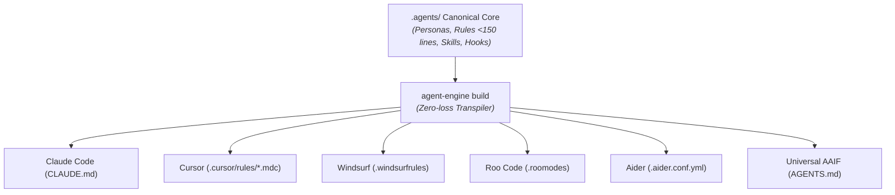

# Open Agent Engine 🚀

> **The open-source compiler & multi-agent runtime for coding agents.**  
> Write canonical agent architecture once (`.agents/`). Transpile into Claude Code, Cursor, Windsurf, Roo Code, Aider, and Linux Foundation AAIF native configurations in milliseconds.

[](LICENSE)
[]()
[]()
[]()

---

## 💡 Why Open Agent Engine?

Modern AI coding agents (Claude Code, Cursor, Windsurf, Roo Code, Aider) are powerful, but developers face massive friction:
- **Prompt Drift & Context Exhaustion**: Giant monolithic prompt files blow past token limits, degrade reasoning, and invalidate prompt caching.
- **Vendor Lock-in**: Every tool invents its own bespoke config format (`CLAUDE.md`, `.cursor/rules/*.mdc`, `.windsurfrules`, `.roomodes`, `.aider.conf.yml`).
- **No Modular Skill Sharing**: No standard way to install, version, or share progressive disclosure agent skills.
- **Cowboy Coding on Main**: Agents edit shared working directories without branch isolation, causing dirty git trees and collisions.

**Open Agent Engine solves this with 4 core pillars:**



1. 🧙‍♂️ **Interactive Scaffolding Wizard (`init`)**: Sets up an AAIF-compliant multi-agent architecture in 1 second.
2. ⚡ **Multi-Platform Compiler (`build`)**: Transpiles canonical `.agents/` AST into 6 native target configurations with zero loss.
3. 📦 **SkillHub Package Manager (`skill`)**: "shadcn for Agent Skills" — install, author, and version progressive disclosure markdown skills directly in your repository.
4. 🌿 **Ephemeral Worktree Engine (`worktree`)**: Windows-resilient Git worktree isolation with exponential lock retries and merge conflict rollback.

---

## ⚡ Quick Start

### 1. Initialize Your Workspace
In any project directory, run:

```bash
npx agent-engine init
```

The interactive wizard asks you which AI coding tools you use and scaffolds the canonical `.agents/` directory:

```text
┌  Welcome to Open Agent Engine
│
◇  What is the name of your project?
│  my-app
│
◇  Which AI coding platforms are you using?
│  ◼ Claude Code (CLAUDE.md)
│  ◼ Cursor (.cursor/rules)
│  ◻ Windsurf (.windsurfrules)
│
└  ✔ Initialized your workspace! Generated native configs in 14ms.
```

### 2. Install Battle-Tested Agent Skills
Add skills directly from the built-in community catalog:

```bash
# Context snapshotting and session continuity
npx agent-engine skill add antigravity-handoff --build

# Multi-pass automated code review gate
npx agent-engine skill add code-reviewer --build

# Multi-subagent worktree coordination
npx agent-engine skill add subagent-coordinator --build
```

### 3. Compile Target Configurations
Rebuild native target files whenever you update skills or personas:

```bash
npx agent-engine build
```

---

## 📦 Canonical `.agents/` Architecture

Open Agent Engine enforces a clean, progressive disclosure folder structure:

```text
.agents/
├── config.yaml          # Project configuration, targets, and skills registry
├── personas/            # Active agent roles with AAIF frontmatter
│   └── default.md       # Principal Systems Architect persona
├── rules/               # Context-lean guidelines (strictly <150 lines)
│   └── 000-base.md      # Foundational engineering invariants
├── skills/              # Progressive disclosure capabilities (L1, L2, L3)
│   ├── antigravity-handoff/
│   ├── code-reviewer/
│   └── subagent-coordinator/
└── hooks/               # Tool execution safety guardrails
    └── hooks.json
```

---

## 🛠️ CLI Command Reference

| Command | Description |
| :--- | :--- |
| `agent-engine init [dir]` | Interactive scaffolding wizard for new or existing repositories |
| `agent-engine init -y` | Non-interactive fast setup with defaults |
| `agent-engine build` | Transpile canonical core to all configured target platforms |
| `agent-engine skill list` | List all installed workspace skills and validation status |
| `agent-engine skill list --catalog` | List installed skills + available community catalog skills |
| `agent-engine skill add <name>` | Install a skill from catalog, local path, or URL |
| `agent-engine skill create <name>` | Scaffold a new progressive disclosure skill template |
| `agent-engine skill remove <name>` | Remove an installed skill and update config |

---

## 🧩 Supported Platforms

| Platform | Target Artifacts | Features Supported |
| :--- | :--- | :--- |
| **Claude Code** | `CLAUDE.md`, `.claude/agents/*.md`, `.claude/settings.json` | Subagents, Tool Hooks, Invariants |
| **Cursor** | `.cursor/rules/*.mdc` | MDC Frontmatter, Globs, AlwaysApply |
| **Windsurf** | `.windsurfrules`, `.windsurf/rules/*.md` | Character Budgets, Cascade Invariants |
| **Roo Code / Cline** | `.roomodes`, `.clinerules` | Custom Mode Slugs, Tool Whitelisting |
| **Aider** | `.aider.conf.yml`, `.aider.prompt.md` | Read-only Auto-commits, Formatting |
| **Universal AAIF** | `AGENTS.md` | Linux Foundation AAIF Specification |

---

## 🧪 Testing & Verification

Open Agent Engine is thoroughly tested with a 100% passing test suite across all modules:

```bash
# Run Vitest test suite
pnpm test

# Run TypeScript typechecks
pnpm typecheck
```

```text
Test Files  20 passed (20)
     Tests  136 passed (136)
  Duration  7.69s
```

---

## 🤝 Contributing

Contributions are warmly welcomed! Please read our [Contributing Guide](CONTRIBUTING.md) and [Code of Conduct](CODE_OF_CONDUCT.md) before submitting pull requests.

---

## 📄 License

Open Agent Engine is open-source software licensed under the [MIT License](LICENSE).
