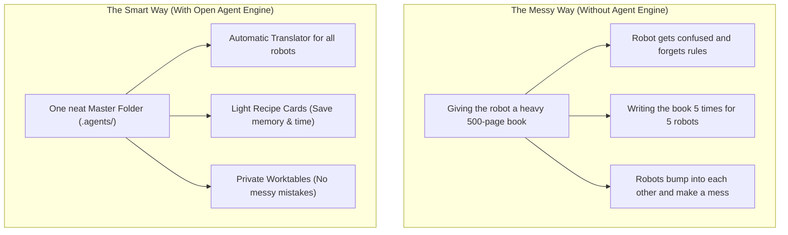
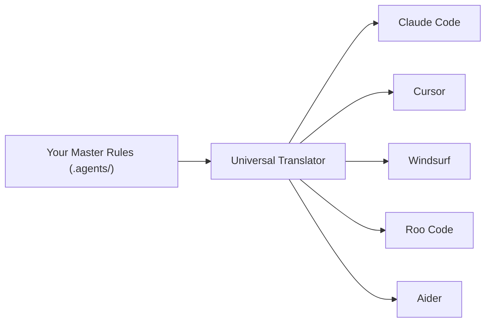
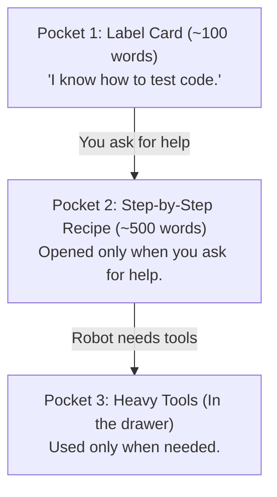
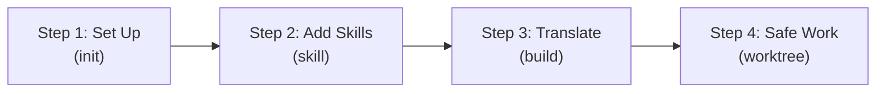

# Open Agent Engine: The Simple Beginner Guide (ELI5) 🎈

> **A friendly guide for everyone. No coding experience needed!**

---

## 1. What is Open Agent Engine? (The Toy Workshop Story)

Imagine you run a toy workshop. You have friendly **robot helpers** (like Claude, Cursor, and Windsurf) to help you build toys.

### The 3 Big Problems Today:
1. **The Heavy Backpack (Too Many Words)**: People give robots huge text files with thousands of rules. The robot gets tired, forgets instructions, and costs more money.
2. **Different Robot Languages**: Every AI tool needs a different file type. You have to write your rules again and again for each tool.
3. **The Crowded Table**: Robots try to change the same project at the same time and make a big mess.

---

## 2. How Open Agent Engine Solves This

Open Agent Engine works like a **smart workshop manager**:

### 1. The Master Folder (`.agents/`)
You write your rules and robot roles **one time** in one neat folder.

### 2. The Universal Translator (`build`)
With one click, it translates your rules into the exact format that Claude, Cursor, Windsurf, Roo Code, and Aider understand.

### 3. The 3-Pocket System (Progressive Disclosure)
Instead of giving the robot everything at once, we use **3 smart pockets**:

- **Pocket 1 (Light Label)**: The robot only carries a short note saying what it can do. This takes almost no memory.
- **Pocket 2 (Recipe Card)**: The robot only reads the full steps when you actually ask for that task.
- **Pocket 3 (Toolbox)**: Big tools stay in the storage drawer until they are needed.

> **💡 Why this is great**: The robot stays 90% lighter, thinks faster, and does not get confused!

---

## 3. The 4 Easy Steps of the Workflow

1. **Step 1: Set Up (`agent-engine init`)**
   - You answer 2 quick questions.
   - The engine creates your master folder with helper roles ready to go.

2. **Step 2: Add Skills (`agent-engine skill add`)**
   - Pick new skills from a shared library (like code review, writing tests, or making clean designs).
   - The skills are added as neat, light cards.

3. **Step 3: Translate (`agent-engine build`)**
   - In less than one second, your rules are translated for all your AI tools.

4. **Step 4: Safe Work (`agent-engine spawn`)**
   - Each robot gets its own **private worktable** (a safe branch).
   - Another robot helper checks the work before anything is put into the main project.

---

## 4. Helpful Words (Glossary)

| Word | What it means in simple English |
| :--- | :--- |
| **Agent / Subagent** | A smart robot helper with a specific job (like a tester or writer). |
| **Skill** | A recipe card that teaches a robot how to do one special task. |
| **Transpiler** | A fast translator that turns one rule file into formats for other tools. |
| **Worktree** | A private table where a robot can build things without breaking the main table. |
| **Token** | A piece of a word that the AI reads. Fewer tokens = faster and cheaper. |
