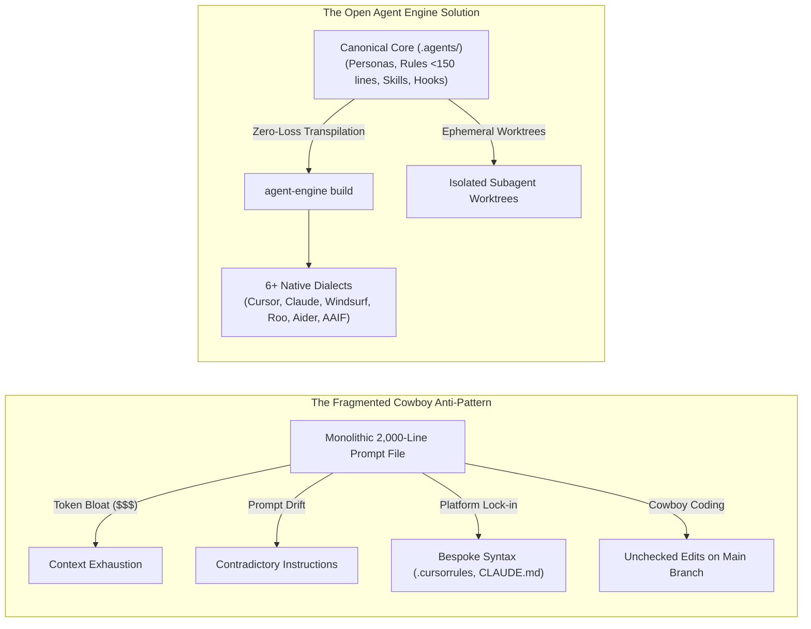
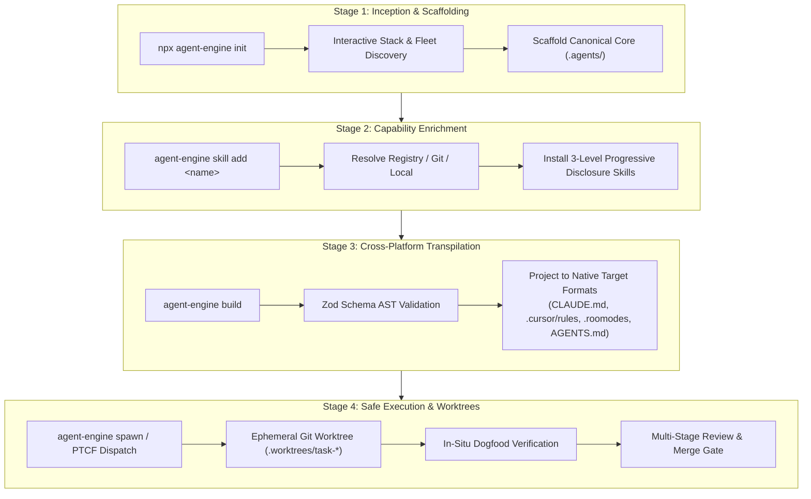
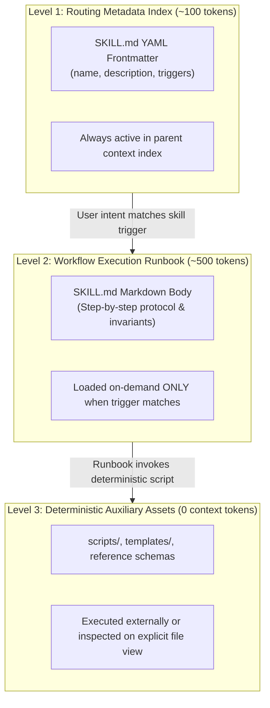
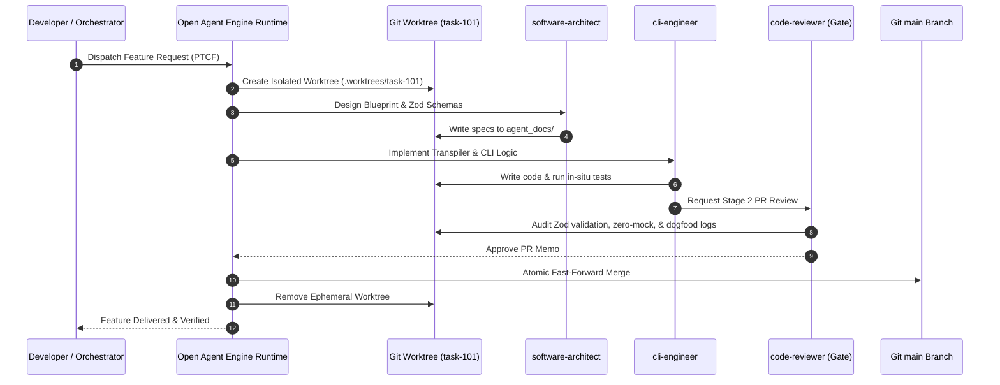

# Open Agent Engine: Educational Workflow & Mental Model Guide

> **A deep dive into modern AI coding agent architecture: moving from ad-hoc prompt dumping to spec-driven canonical engineering.**

---

## 1. The Core Paradigm Shift: Cowboy Prompts vs. Canonical Architecture

### The Problem: The "Cowboy Prompting" Crisis
As engineering teams adopt AI coding assistants (Claude Code, Cursor, Windsurf, Roo Code, Aider), they quickly encounter four compounding failure modes:

| Friction Point | Traditional Ad-Hoc Approach | Open Agent Engine Architecture |
| :--- | :--- | :--- |
| **Configuration Source** | Duplicate files (`CLAUDE.md`, `.cursorrules`, etc.) drifting out of sync. | **Single Source of Truth** (`.agents/`) with model-agnostic AST. |
| **Token Consumption** | Monolithic prompt files loaded on every turn (~2,000–5,000 tokens). | **3-Level Progressive Disclosure** (~100 tokens baseline index). |
| **Instruction Quality** | Bloated prompts degrade LLM attention and invalidate prompt caching. | **Context-lean rules** (<150 lines per rule) preserving prompt cache. |
| **Execution Safety** | Subagents make unvetted edits directly on the active working branch. | **Ephemeral Git Worktrees** with mandatory review & test gates. |

---

## 2. The 4-Stage Operational Workflow

The Open Agent Engine workflow follows a predictable 4-stage lifecycle: **Scaffold**, **Equip**, **Transpile**, and **Isolate & Execute**.

### Stage 1: Inception (`agent-engine init`)
- Detects the project stack (Node.js, Python, Monorepo, Next.js, Vite).
- Scaffolds the `.agents/` canonical directory containing:
  - `config.yaml`: Project metadata, active targets, and skills registry.
  - `personas/`: Specialized agent roles (`qa-behavioral-architect`, `software-architect`, etc.).
  - `rules/`: Modular, scoped invariants (strictly under 150 lines).
  - `hooks/`: Deterministic safety guardrails (e.g. blocking destructive commands).

### Stage 2: Capability Enrichment (`agent-engine skill add / create`)
- Installs composable capabilities using progressive disclosure into `.agents/skills/`.
- Resolves skills from the official registry, GitHub repositories, or local paths.

### Stage 3: Cross-Platform Transpilation (`agent-engine build`)
- Validates canonical AST against strict Zod schemas.
- Compiles the canonical AST into native target files with zero loss:
  - **Claude Code**: Emits `CLAUDE.md`, `.claude/agents/*.md`, `.claude/settings.json`.
  - **Cursor**: Emits `.cursor/rules/*.mdc` with intelligent `globs` and `alwaysApply` flags.
  - **Windsurf**: Emits `.windsurfrules` and `.windsurf/rules/*.md`.
  - **Roo Code / Cline**: Emits `.roomodes` with custom permission groups and `.clinerules`.
  - **Aider**: Emits `.aider.conf.yml` and `.aider.prompt.md`.
  - **Universal AAIF**: Emits Linux Foundation `AGENTS.md`.

### Stage 4: Isolated Execution & Subagent Gating (`agent-engine spawn`)
- Dispatches subagents using the **PTCF Framework** (Persona, Task, Context, Format).
- Runs tasks inside isolated Git worktrees (`.worktrees/task-<id>`), preventing unvetted collisions on `main`.
- **Repository Ruleset Security Gate**:
  - The `main` branch is protected by GitHub Repository Rulesets: direct pushes, deletions, and force pushes are blocked.
  - Merging into `main` requires a Pull Request with at least 1 approval and resolved review threads.
  - Only repository administrators hold bypass privileges for emergency maintenance.
- Enforces a 3-stage quality gate:
  1. **Stage 1**: Implementation subagent writes code and verifies tests.
  2. **Stage 2**: `code-reviewer` audits the diff against architectural contracts.
  3. **Stage 3**: `technical-writer` executes documentation sweeps.

---

## 3. The 3-Level Progressive Disclosure Mental Model

Why not dump all instructions into the prompt at once? Because LLM attention is a finite resource. Progressive disclosure optimizes token budgets and keeps prompt caches hot.

### Token Economics Comparison

| Metric | Monolithic Prompts (Old) | Progressive Disclosure (Agent Engine) | Impact |
| :--- | :--- | :--- | :--- |
| **Baseline Turn Cost** | ~3,500 tokens | ~320 tokens | **90% Token Reduction** |
| **Prompt Cache Hit Rate** | &lt; 20% (frequent cache invalidation) | &gt; 95% (lean, stable prefix) | **4x Faster Latency** |
| **Reasoning Accuracy** | Degrades as prompt exceeds 10k tokens | Focuses 100% on active task context | **Zero Rule Hallucination** |

---

## 4. Subagent Orchestration & Choreography

Open Agent Engine coordinates multiple specialized subagents with clear domain boundaries:

---

## 5. Architectural Invariants for Educational Content

When designing educational tooling, CLI output, or documentation:
1. **Explain the "Why" with Every Rule**: Never state a naked constraint. Always pair rules with architectural rationale (e.g. *Why* keep rules under 150 lines? *Why* use Git worktrees?).
2. **Visual Over Textual**: Use clean, valid Mermaid diagrams and before/after comparison tables.
3. **Progressive Complexity**: Introduce concepts in layers: Core Mental Model -> CLI Commands -> Canonical AST -> Multi-Agent Choreography.
